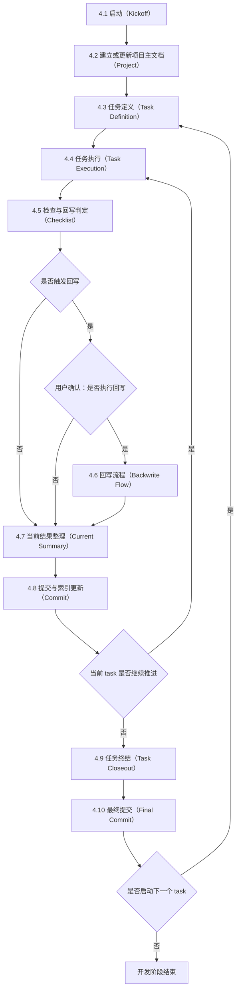

# Doc-Driven-Dev

## 1. 定位

这是一个文档驱动开发 skill。它要求先维护 `doc/project.md` 这个项目主文档，再以 `task` 作为最小实施与交付单元推进工作。

这里的 `project.md` 是项目级全集。它负责承载项目介绍、目的、路线、设计与长期有效的规则，不是某一次 task 的执行记录。第 1 章用于维护短小稳定的全局规则，其余章节用于展开项目背景、目标、阶段安排和设计内容。

## 2. 适用场景

- 初始化一个需要 `doc/` 体系的新项目或新仓库。
- 推进一个可拆成最小交付单元的开发、重构、迁移或文档任务。
- 变更会影响项目级规则、目标、边界、术语、设计或长期保留结论。
- 需要在主线实施之外，并行记录 bug、新需求、风险、疑问或改进建议。

## 3. 核心产物

- `doc/project.md`：项目主文档，承载项目介绍、目的、路线、设计与全局规则。
  模板：`references/project_template.md`
- `doc/tasks.md`：任务注册表，只维护 task 索引、状态与文件路径。
  模板：`references/tasks_template.md`
- `doc/task-编号-概述.md`：最小实施单元工作台，记录目标、边界、方案、执行情况与终结结论。
  模板：`references/task_template.md`
- `doc/findings.md`：可选的并行发现项登记表，用于记录主流程之外产出的 bug、需求、风险或疑问。
  模板：`references/finding_template.md`

## 4. 开发执行流程（SOP）

本节是唯一主流程定义。流程图、文字步骤、回写规则与提交流转必须一致；如发生冲突，以本节为准。

### 4.1 启动（Kickoff）

定位：建立当前项目与当前 task 的执行起点，确认操作边界、文档边界与命名基线。

执行步骤：
1. 准备仓库基线：若当前目录尚未初始化 Git 仓库，则先执行 `git init`；随后将 `references/VisualStudio.gitignore` 复制并重命名为 Git 根目录下的 `.gitignore`。
2. 确认项目背景：明确当前项目、当前阶段与本轮 task 在整体推进中的位置。
3. 确认 task 编号：明确当前 task ID 与文件名，格式必须为 `task-编号-概述`。
4. 准备文档根目录：确认 `doc/` 目录存在；不存在则创建。
5. 建立任务索引：按 `references/tasks_template.md` 初始化或更新 `doc/tasks.md`。

### 4.2 建立或更新项目主文档（Project）

定位：用 `doc/project.md` 维护项目级全局规则、项目介绍、目标、路线与设计，作为后续 task 的总背景与总约束。

执行步骤：
1. 新建或更新 `doc/project.md`。
2. 按 `references/project_template.md` 先填写第 1 章“全局规则”，把短小稳定的仓库级规则统一落在这里。
3. 按 `references/project_template.md` 继续填写项目介绍、项目目的、路线图与设计内容。
4. `project.md` 只写项目级内容，不写某一次 task 的执行流水；具体实施细节留在 `task` 文档中。
5. 明确哪些变化需要回写 `project.md` 第 1 章“全局规则”，哪些变化需要回写其余项目章节，哪些变化只需留在 task 文档中。

### 4.3 任务定义（Task Definition）

定位：把当前最小交付单元的目标、边界、方案与验证口径固定在 `doc/task-编号-概述.md`，并尽量保持结构简短，作为后续执行与提交的唯一工作台。

执行步骤：
1. 新建或更新 `doc/task-编号-概述.md`。
2. 按 `references/task_template.md` 补齐“任务定义”“执行方案”章节。
3. 明确本 task 的目标、验收、边界与预期回写点，避免写入低价值解释性内容。
4. 在 `doc/tasks.md` 中登记该 task，状态初始化为 `TODO` 或 `DOING`。

### 4.4 任务执行（Task Execution）

定位：task 的实施直接写在同一个 task 文档中持续更新。

执行步骤：
1. 在 `doc/task-编号-概述.md` 的“执行结果”章节中更新实施、验证与结论。
2. 记录实施：写清已完成的改动、关键决定与实际结果。
3. 记录验证：写清实际验证了什么、结果如何，以及关键证据。
4. 若 task 目标、边界、方案或验证方式发生调整，直接更新前文对应章节，并在结论中写明变化原因与影响。
5. 记录结论：给出当前结果、剩余风险与下一步边界。
6. 进入 4.5 执行检查与回写判定。

### 4.5 检查与回写判定（Checklist）

定位：基于当前 task 的执行内容检查文档一致性，并判断哪些变化需要沉淀回 task 定义或 `project.md`。

执行步骤：
1. 核对基础完整性：检查 `doc/project.md`、`doc/tasks.md`、当前 task 文档的命名、结构与状态是否一致。
2. 核对执行内容完整性：检查当前 task 的实施、验证与结论是否及时落盘。
3. 归并项目级变化：从当前 task 中提炼会影响项目理解与后续协作的变化，例如项目规则、背景约束、阶段目标、设计结论、接口边界、术语口径与长期已知问题。
4. 判定回写范围：仅影响当前实施过程的临时尝试、废弃方案或短期过程，不进入正式回写；凡会影响后续理解与协作的变化，都视为回写候选。
5. 形成回写结论：若无回写候选，记录“当前 task 未触发回写”；若存在回写候选，明确触发原因、影响层级与回写对象，并区分是否需要更新 `project.md` 第 1 章“全局规则”或其余项目章节。
6. 生成回写清单：按文档分别列出要更新的章节、条目、证据来源与一致性校验点，作为是否执行回写的输入。

### 4.6 回写流程（Backwrite Flow）

定位：当 4.5 判定触发回写且用户确认执行时，同步更新 `project.md` 与 task 定义。

执行步骤：
1. 在当前 task 文档中写清触发回写的事实变化、影响范围与回写对象。
2. 回写 `project.md`：凡影响项目介绍、目标、路线、设计、长期结论或全局规则的变化，都按清单更新到对应章节；若变化属于仓库级全局规则，也同步更新第 1 章。
3. 回写 task 文档：更新 `doc/task-编号-概述.md` 中受影响的任务定义、执行方案、执行结果或终结说明。
4. 校验一致性：复查 `project.md`、task 文档、代码与测试结果是否对同一事实保持一致。
5. 整理回写摘要：汇总已更新条目、证据位置、未处理项与剩余风险，作为 4.7 的输入。

### 4.7 当前结果整理（Current Summary）

定位：把当前 task 的结果、证据与回写摘要整理成可提交的输入材料。

执行步骤：
1. 汇总结论：整理当前 task 的结果、测试结论与证据摘要。
2. 汇总回写：若执行了回写，则附上回写摘要；若触发回写但确认不执行，则写明不执行原因；若未触发回写，则写明“当前 task 未触发回写”。
3. 准备提交输入：将上述内容整理为 4.8 的提交描述来源。

### 4.8 提交与索引更新（Commit）

定位：先把当前 task 已完成的结果固化为一次可追溯提交，再决定是否继续推进当前 task。

执行步骤：
1. 提交前核对：确认工作区改动与 4.7 的结果整理一致，且回写闭环已完成。
2. 更新索引：若当前 task 仍在推进，则将 `doc/tasks.md` 中状态保持为 `DOING`；禁止在索引中写入技术细节。
3. 生成提交信息：从当前 task 文档中的最新结论摘录提交描述，提交信息按仓库约定组织，且必须包含 `task-编号-概述` 标识。
4. 执行提交：完成一次提交。
5. 进入流转：若当前 task 仍需继续推进，则回到 4.4；否则进入 4.9。

### 4.9 任务终结（Task Closeout）

定位：当当前 task 不再继续推进时，整理任务级验收材料、更新索引状态，并形成最终收尾结论。

执行步骤：
1. 在 `doc/task-编号-概述.md` 的“任务终结”章节中补齐最终交付、验收结论与剩余风险。
2. 更新 `doc/tasks.md` 中对应 task 的状态为 `DONE`，确保文件路径与任务编号正确。
3. 若仍有遗留问题或后续建议，在 task 文档中写清对应说明。

### 4.10 最终提交（Final Commit）

定位：将 task 终结阶段的文档状态更新与收尾说明固化为最终一次提交。

执行步骤：
1. 提交前核对：确认 4.9 的 task 终结说明、`doc/tasks.md` 状态更新与相关文档改动已经完整落盘。
2. 生成提交信息：从 task 文档“任务终结”中的结论摘录最终提交描述，提交信息按仓库约定组织，且必须包含 `task-编号-概述` 标识。
3. 执行提交：完成最终一次提交。
4. 若后续还有新的 task，则回到 4.3；否则结束本轮开发阶段。

## 5. 并行发现项规则（Finding）

`finding` 是旁路记录，不是主流程节点。它可以来自并行 review、测试、排查、用户反馈或临时观察，但它不改变第 4 章的 task 主流程，也不构成第 4 章的前置条件、检查项或回写项。

使用规则：
1. 只有在存在并行发现记录需求时，才创建 `doc/findings.md`。
2. `doc/findings.md` 使用评审报告结构：先写“范围”，再写“结论”，然后列 Findings，最后补“说明”。
3. Findings 按严重度排序；若没有有效偏差，明确写“本次无有效 Findings”。
4. 每条 finding 只写现状、基线、证据、影响、建议，避免写成过程流水账。
5. finding 的标准去向只有四类：并入当前 task、新建 task、暂存、废弃。
6. finding 本身不直接生成提交；提交必须来自 task 文档中的执行结论或任务终结结论。
7. 若某条 finding 最终演变为长期有效的约束、已知问题或稳定口径，可在合适时机回写 `doc/project.md`，但这不改变第 4 章主流程。
