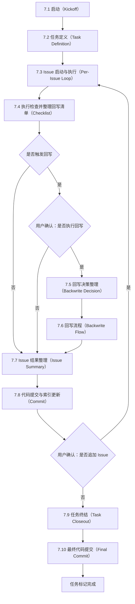

# Doc-SSOT-Flow

## 1. 定位

这是一个文档驱动的开发执行 skill。它要求把 `doc/project.md` 作为全局技术基准，把 `doc/task-xxx.md` 作为单任务工作台，把 `doc/tasks.md` 作为任务索引；所有开发动作都先落文档，再进入代码、回写与提交。

## 2. 适用场景

- 初始化使用 `doc/` 体系的新项目或新仓库。
- 启动一个需要持续记录分析、计划、测试与结论的任务。
- 变更影响模块职责、接口契约、数据流、依赖、权限、状态机或回归处理口径。

## 3. 核心产物

- `doc/project.md`：项目级技术基准，负责沉淀稳定事实。
- `doc/tasks.md`：任务注册表，只维护任务索引与状态。
- `doc/task-xxx.md`：任务执行工作区，按 Issue 追加分析、计划、测试、结论与回写依据。

## 4. 使用原则

- 文档先行：先更新文档，再实施代码或结构变更。
- 单一事实源：全局事实只写入 `doc/project.md`，任务事实只写入对应的 `doc/task-xxx.md`。
- Issue 驱动：每次推进都以一个 Issue 为最小记录与提交单元。
- 回写闭环：一旦触发全局变化，必须通过回写流程同步 `project.md` 与任务文档。
- 可追溯提交：提交信息必须来自任务文档中的结论，而不是事后反推。

## 5. 模板文件

- `references/project_template.md`
- `references/tasks_template.md`
- `references/task_template.md`

## 6. 基础约束

- 全中文交互；统一 UTF-8（无 BOM）；`doc/` 为文档根目录。
- 与工程相关的关键决策与约束，以 `doc/project.md` 为唯一技术基准；任务细节以 `doc/task-xxx.md` 为唯一工作台。

## 7. 开发执行流程（SOP）

本节是唯一流程定义。流程图、文字步骤、回写规则与提交流转必须严格一致；如发生冲突，以本节为准。

### 7.1 启动（Kickoff）

定位：建立本任务的执行起点，统一确认任务边界、操作边界与文档基线，为后续任务定义与 Issue 执行提供前提。

执行步骤：
1. 准备仓库基线：若当前目录尚未初始化 Git 仓库，则先执行 `git init`；随后将 `references/VisualStudio.gitignore` 复制并重命名为 Git 根目录下的 `.gitignore`。
2. 确认任务编号：明确本次任务 ID `task-xxx` 与初始 Issue 编号。
3. 准备文档根目录：确认 `doc/` 目录存在；不存在则创建。
4. 建立全局基线：按 `references/project_template.md` 初始化或更新 `doc/project.md`。
5. 建立任务索引：按 `references/tasks_template.md` 初始化或更新 `doc/tasks.md`。

### 7.2 任务定义（Task Definition）

定位：把本任务的可验收目标、边界与局部设计固定在 `doc/task-xxx.md`，并作为后续 Issue 循环的约束来源。

执行步骤：
1. 准备任务文档：新建或更新 `doc/task-xxx.md`。
2. 固定任务定义：按 `references/task_template.md` 补齐“需求”“约束”“设计”章节。
3. 维护定义一致性：若 Issue 的范围、方案或验证方式变化，必须在对应 Issue 下记录变更原因与影响，并纳入 7.4 的回写清单；需要更新任务定义时，在 7.6 回写流程中统一更新。

### 7.3 Issue 启动与执行（Per-Issue Loop）

定位：以 Issue 为最小执行单元推进开发；每个 Issue 的分析、计划、测试与结论必须落在 `doc/task-xxx.md` 的“执行记录”章节下，并为后续检查、回写与提交提供完整输入。

执行步骤：
1. Issue 启动：确认 Issue 编号，并在 `doc/task-xxx.md` 的“执行记录”新增对应 Issue 区块。
2. 记录分析：写清要解决的问题与影响面。
3. 记录计划：写清将要做的修改、验证方式与完成边界。
4. 记录变更：若计划、方案或验证方式调整，追加写明原因与影响，并在 7.4 的回写清单中列为回写项。
5. 记录测试：在测试列表下记录范围、步骤、结果、成功日志与失败日志。
6. 记录结论：给出最终结果、原因与下一步边界，并写清本 Issue 的变更摘要与风险点。
7. 进入检查：转入 7.4 执行检查并整理回写清单。

### 7.4 执行检查并整理回写清单（Checklist）

定位：对齐硬性约束、文档一致性与回写判定，并产出回写清单；本节只负责检查与整理，不承担用户判断环节。

执行步骤：
1. 结构核对：核对 `doc/project.md`、`doc/tasks.md`、`doc/task-xxx.md` 的模板完整性、命名编号与索引约束，记录不满足项与证据位置。
2. 记录核对：核对 Issue 执行记录的时效性与不可改写要求，核对描述口径与测试归属是否完整，记录不满足项与证据位置。
3. 回归与事故核对：若出现回归或事故，则必须在 `doc/project.md` 的“回归与事故”中登记触发记录，并在 `doc/task-xxx.md` 的对应 Issue 下补齐证据与处置结论，且两边互相可追溯。
4. 事故判定口径：满足任一即按事故处理并进入第 3 步核对范围：可用性明显下降或中断、数据错误或丢失、安全边界被突破或疑似突破、影响范围不可控或需要紧急回滚。
5. 同步核对：核对范围、方案或验证方式变化时是否同步更新任务定义，核对回归与事故触发时是否完成 project 与 task 的双向关联与证据补齐。
6. 回写判定：检查是否发生以下任一变化；任一命中即视为触发回写，未命中则跳过第 7 步，直接进入第 8 步。
   - 模块与接口：新增或删除模块、职责变化；跨模块 API 或事件契约变更。
   - 数据与机制：关键数据流或存储边界变化；幂等或重试策略变化；权限模型、状态机、错误分类或告警策略变化。
   - 外部依赖：第三方服务或基础设施增减；SLA、限流或降级策略变化。
7. 整理回写清单：列出本次需要回写的具体条目，至少覆盖任务文档回写项、全局文档回写项与一致性校验点，作为用户确认“是否执行回写”的输入材料。
8. 进入后续：若未触发回写，则直接进入 7.7；若触发回写，则等待用户确认后决定进入 7.5 或直接进入 7.7。

### 7.5 回写决策整理（Backwrite Decision）

定位：当 7.4 判定触发回写且用户确认执行回写时，先整理回写输入与执行边界，再进入正式回写流程。

执行步骤：
1. 记录确认结果：在当前 Issue 的“结论”中记录用户确认执行回写及其原因。
2. 明确回写边界：按 7.4 产出的回写清单，明确本轮需要回写的文档、条目与一致性校验点。
3. 进入回写：将整理结果作为 7.6 的直接输入。

### 7.6 回写流程（Backwrite Flow）

定位：当触发回写且用户确认执行回写时，用同一套步骤同时闭合 `doc/project.md` 与 `doc/task-xxx.md`；任务定义更新属于回写的一部分，禁止拆成独立流程。

执行步骤：
1. 写明触发原因：在 `doc/task-xxx.md` 的对应 Issue 的“变更”或“结论”中写清触发条目与影响范围。
2. 回写任务文档：按回写清单同步更新 `doc/task-xxx.md` 的“需求”“约束”“设计”“接口契约”，保证与实际代码与执行记录一致。
3. 回写全局文档：按回写清单更新 `doc/project.md` 的受影响章节，保证模块职责、接口契约、数据流、依赖、权限与状态机描述与现状一致。
4. 一致性校验：复查 `doc/project.md` 与 `doc/task-xxx.md` 对同一事实的表述是否一致，避免相互矛盾。
5. 回写复核：按回写清单逐条核对已回写内容与证据位置，确保回写后的文档口径一致。
6. 回写摘要：整理本次回写的条目清单与关键变更点，作为 7.7 的输入。

### 7.7 Issue 结果整理（Issue Summary）

定位：将当前 Issue 的结果、证据与回写摘要整理为后续“是否追加 Issue”的输入材料，保证判断基于事实与证据。

执行步骤：
1. 汇总结论：整理当前 Issue 的结论、测试结果与证据摘要。
2. 汇总回写：若执行了回写，则附上回写清单与回写摘要；若触发回写但用户确认不执行，则写明不执行原因；若未触发回写，则写明“本轮未触发回写”。
3. 提交输入：将上述汇总作为 7.8 的输入材料。

### 7.8 代码提交与索引更新（Commit）

定位：将 7.7 整理出的本轮结果先固化为一次可追溯提交；索引更新与状态更新必须与提交同步，避免后续追加 Issue 或结束 task 时出现记录漂移。

执行步骤：
1. 提交前核对：确认工作区改动与 7.7 的结果整理一致；确认回写闭环与回归记录（如适用）已完成且可追溯。
2. 更新索引：更新 `doc/tasks.md` 的任务状态与文件路径；若后续仍需继续执行则状态置为 DOING，禁止写入技术细节。
3. 生成提交信息：从 `doc/task-xxx.md` 当前 Issue 的“结论”摘录提交描述，提交信息按仓库约定组织，且必须包含 `task-xxx` 标识。
4. 执行提交：完成一次提交。
5. 进入流转：提交完成后，根据用户对“是否追加 Issue”的确认结果，追加则直接回到 7.3，不追加则进入 7.9。

### 7.9 任务终结（Task Closeout）

定位：当用户确认不再追加 Issue 时，整理任务级验收材料、更新任务状态，并为最终提交准备完整收尾信息。

执行步骤：
1. 整理验收材料：汇总最终产出、验证口径、证据摘要与剩余风险，形成任务终结说明。
2. 更新任务索引：将 `doc/tasks.md` 中对应任务状态更新为 DONE，确保路径与任务编号正确。
3. 固化终结结论：在 `doc/task-xxx.md` 的最后一个 Issue 结论中补齐任务终结说明，作为最终提交描述来源。

### 7.10 最终代码提交（Final Commit）

定位：将任务终结阶段的状态更新与收尾说明固化为最终一次提交，随后才允许将任务标记为完成。

执行步骤：
1. 提交前核对：确认 7.9 的任务终结说明、`doc/tasks.md` 状态更新与相关文档改动已经完整落盘。
2. 生成提交信息：从 `doc/task-xxx.md` 的任务终结说明中摘录最终提交描述，提交信息按仓库约定组织，且必须包含 `task-xxx` 标识。
3. 执行提交：完成最终一次提交。
4. 标记完成：提交完成后，将任务标记为完成并归档为历史快照。
