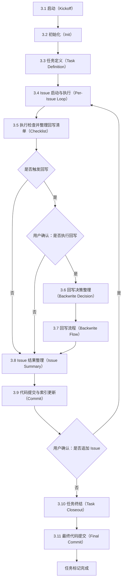

# AI 软件工程协作指令集

## 0. 适用范围与执行方式

- 适用范围：以 `doc/` 为文档根目录的工程协作与交付，包含代码变更与文档变更。
- 单一事实源（SSOT）：与工程相关的关键决策与约束，以 `doc/project.md` 为唯一技术基准；任务细节以 `doc/task-xxx.md` 为唯一工作台。
- 结项门槛：任务标记为完成前，必须获得用户明确批准，并完成回写闭环（见 3.5 执行检查并整理回写清单、3.6 回写决策整理、3.7 回写流程、3.9 代码提交与索引更新、3.10 任务终结与 3.11 最终代码提交）。

## 1. 基础协作与编码规范

- 文件标准：全中文交互；统一 UTF-8（无 BOM）；`doc/` 为文档根目录。
- 编码风格-强逻辑块：`if`、`for`、`while` 即使单行也必须使用大括号 `{}`。
- 编码风格-空行约束：`}` 独占一行后必空行；属性与方法定义之间必空行；逻辑块内部少空行。
- 编码风格-注释格式：注释符号与内容之间保留一个空格。

## 2. 文档模板（SSOT）

本节只定义文档的定位与模板结构。硬性约束与执行门槛统一收敛到 3.5 执行检查并整理回写清单。

### 2.1 全局技术报告（doc/project.md）

定位：项目的唯一技术基准。任何新人仅凭阅读此文件，在不参考任务文档的前提下，也必须能够接手项目。

模板（除可选项外必须填写）：

```md
# 项目技术基准

## 1. 全景

- 背景：业务场景、问题来源、现状痛点与可验证事实。
- 核心目标：可验收结果清单与衡量标准。
- 非目标：明确不做的范围、边界与排除理由。
- 术语表：关键概念、缩写、外部系统代称与解释。

## 2. 架构

- 架构总览：提供 Mermaid 的 C4 标准模块架构图，并说明模块边界、通信方式与部署形态。
- 模块清单：逐项说明模块职责、输入、输出、依赖与数据拥有权。
- 模块设计：核心模块提供关键 UML 设计图与对应的数据流说明。
- 外部依赖：第三方服务与基础设施的接口形态、SLA 与降级策略。
- 关键接口：跨模块 API 或事件契约的字段、校验规则与版本策略。

## 3. 机制

- 数据流向：说明从来源到存储或输出的路径、关键转换、落库位置与读写边界。
- 关键算法：说明名称、输入、输出、复杂度约束、退化策略与可替代方案。
- 权限模型：说明角色、权限矩阵、授权流程、默认策略与最小权限原则。
- 状态机：说明核心对象状态、迁移条件、失败回滚策略与超时策略。
- 异常处理：说明错误分类、重试策略、幂等性、补偿机制与告警触发条件。

## 4. 规约

- 目录结构：说明目录清单、用途与禁止出现的结构形态。
- 分支管理：说明分支类型、合并策略、发布流程与回滚入口。
- 技术栈约定：说明语言、框架、库版本与用途，以及禁止使用的组件与原因。
- 质量门槛：说明测试类型、覆盖率要求、静态检查清单与阻断策略。

## 5. 回归与事故

- 回归问题清单：必须可追踪，禁止只写结论不写复现。
- 记录规则：首次发现登记为一条回归项。
- 触发追加：再次触发同一问题时，必须追加一条触发记录，不得覆盖或改写历史。
- 关联要求：触发记录必须关联到对应的 task 与 Issue，并在 `doc/task-xxx.md` 的对应 Issue 下补齐证据与处置结论。
- 记录字段：每条触发记录至少包含触发条件、复现步骤、证据摘要、影响范围、处置状态、关联 task、关联 issue 与关联 commit（如适用）。

## 6. 运维与变更（可选）

- 运维：说明监控与告警、配置与密钥、审计与合规、容量与成本；不适用写 N/A。
- 变更摘要：只记录跨任务或跨模块的里程碑变更；细节以任务文档为准。
```

### 2.2 任务注册表（doc/tasks.md）

定位：进度仪表盘与索引。

模板（必须使用）：

```md
# 任务注册表

| ID | 简述 | 状态 | 文件 |
| --- | --- | --- | --- |
| task-001 | 示例：用一句话写清可验收的任务目标（禁止实现细节） | TODO、DOING、DONE | doc/task-001.md |
```

### 2.3 单任务工作区（doc/task-xxx.md）

定位：增量开发的唯一工作台。任务一旦标记为完成即归档为历史快照，严禁回头修改。

模板（必须使用）：

```md
# 任务：用一句话写清可验收的任务目标（禁止实现细节）

## 1. 需求

- 用户故事：仅写用户视角行为，不写实现细节。
- 验收标准：必须可验证，写清验证口径或步骤。
- 非目标：明确不做的范围、边界与排除理由；不适用写 N/A。

## 2. 约束

- 用户约束：只描述用户可感知的状态与限制；不适用写 N/A。
- 边界约束：写清只读源、操作区与不可触碰目录或仓库；不适用写 N/A。

## 3. 设计

- 接口契约：拆解 Issue 前先定义模块 API 或接口契约；不适用写 N/A。
- 实现方案：只记录最终方案与原因，过程性尝试放在执行记录里。

## 4. 执行记录

### Issue-001

- 分析：写清要解决的问题、影响面与当前判断。
- 计划：写清将要做的修改、验证方式与完成边界。
- 变更：若发生范围、方案或验证方式调整，记录原因与影响；若未发生，写明“无变更：范围/方案/验证方式均未调整”。
- 测试：
  - 范围：写清本次验证覆盖的功能、场景、边界与不覆盖项；不适用写 N/A。
  - 步骤：写清复现、执行与校验所需的操作步骤、输入与环境前提；涉及命令时将命令作为步骤的一部分写入；不适用写 N/A。
  - 结果：写清成功或失败、证据摘要与是否满足验收标准。
  - 成功日志：记录能够证明修改生效的关键日志、输出摘要或观测结果；若无可记录证据，写明原因与替代证据来源。
  - 失败日志：记录尝试失败、回滚、阻塞或异常时的关键日志、报错摘要与上下文；若无失败记录，写明“未发生失败或回滚”。
- 结论：给出最终结果、原因与下一步边界；不适用写 N/A。
```

## 3. 开发执行流程（SOP）

本节是唯一流程定义：流程图、文字步骤、检查表与回写流程必须互相一致。

整体流程图（Mermaid）：



### 3.1 启动（Kickoff）

定位：确认本任务的编号边界与工作边界，为后续文档与代码变更提供明确前提。

执行步骤：
1. 明确范围：确认本次任务 ID `task-xxx` 与初始 Issue 编号。
2. 明确边界：定义只读源与操作区；如涉及跨目录操作或脚本执行，必须先确认只读源 Git 状态为 clean。
3. 先文档后代码：所有关键决策与约束先落到 `doc/` 再改代码。

### 3.2 初始化（Init）

定位：初始化或补齐 SSOT 文档骨架，保证 project、tasks、task 三类文档具备可持续维护的起点。

执行步骤：
1. 确认 `doc/` 目录存在；不存在则创建。
2. 初始化或更新 `doc/project.md`：按模板结构增量更新，不适用写 N/A。
3. 初始化或更新 `doc/tasks.md`：登记任务索引，只写 ID、简述、状态与文件路径。

### 3.3 任务定义（Task Definition）

定位：把本任务的可验收目标、边界与局部设计固定在 `doc/task-xxx.md`，并作为后续 Issue 循环的约束来源。

执行步骤：
1. 新建或更新 `doc/task-xxx.md`。
2. 在 `doc/task-xxx.md` 的“需求”“约束”“设计”章节下补齐任务定义。
3. 若 Issue 的范围、方案或验证方式变化，必须在对应 Issue 下记录变更原因与影响，并纳入 3.5 的回写清单；需要更新任务定义时在 3.7 回写流程中统一更新，禁止只在执行记录里补充。

### 3.4 Issue 启动与执行（Per-Issue Loop）

定位：以 Issue 为最小执行单元推进开发；每个 Issue 的分析、计划、测试与结论必须落在 `doc/task-xxx.md` 的“执行记录”章节下，并为后续检查、回写与提交提供完整输入。

执行步骤：
1. Issue 启动：确认 Issue 编号，并在 `doc/task-xxx.md` 的“执行记录”新增对应 Issue 区块。
2. 记录分析：写清要解决的问题与影响面。
3. 记录计划：写清将要做的修改、验证方式与完成边界。
4. 记录变更：若计划、方案或验证方式调整，追加写明原因与影响，并在 3.5 的回写清单中列为回写项。
5. 记录测试：在测试列表下记录范围、步骤、结果、成功日志与失败日志。
6. 记录结论：给出最终结果、原因与下一步边界，并写清本 Issue 的变更摘要与风险点。
7. 进入检查：转入 3.5 执行检查并整理回写清单，等待后续用户确认关口。

### 3.5 执行检查并整理回写清单（Checklist）

定位：对齐硬性约束、文档一致性与回写判定，并产出回写清单；本节只负责检查与整理，不承担用户判断环节。

执行步骤：
1. 结构核对：核对 `doc/project.md`、`doc/tasks.md`、`doc/task-xxx.md` 的模板完整性、命名编号与索引约束，记录不满足项与证据位置。
2. 记录核对：核对 Issue 执行记录的时效性与不可改写要求，核对描述口径与测试归属是否完整，记录不满足项与证据位置。
3. 回归与事故核对：若出现回归或事故，则必须在 `doc/project.md` 的“回归与事故”中登记触发记录，并在 `doc/task-xxx.md` 的对应 Issue 下补齐证据与处置结论，且两边互相可追溯。
4. 事故判定口径：满足任一即按事故处理并进入第 3 步核对范围：可用性明显下降或中断、数据错误或丢失、安全边界被突破或疑似突破、影响范围不可控或需要紧急回滚。
5. 同步核对：核对范围、方案或验证方式变化时是否同步更新任务定义，核对回归与事故触发时是否完成 project 与 task 的双向关联与证据补齐。
6. 回写判定：检查是否发生以下任一变化；任一命中即视为触发回写，未命中则跳过第 7 步，直接进入第 8 步。
   - 模块与接口：新增或删除模块、职责变化；跨模块 API 或事件契约变更。
   - 数据与机制：关键数据流或存储边界变化；幂等或重试策略变化；权限模型、状态机、错误分类或告警策略变化。
   - 外部依赖：第三方服务或基础设施增减；SLA、限流或降级策略变化。
7. 整理回写清单：列出本次需要回写的具体条目，至少覆盖任务文档回写项、全局文档回写项与一致性校验点，作为用户确认“是否执行回写”的输入材料。
8. 进入后续：若未触发回写，则直接进入 3.8；若触发回写，则等待用户确认后决定进入 3.6 或直接进入 3.8。

### 3.6 回写决策整理（Backwrite Decision）

定位：当 3.5 判定触发回写且用户确认执行回写时，先整理回写输入与执行边界，再进入正式回写流程。

执行步骤：
1. 记录确认结果：在当前 Issue 的“结论”中记录用户确认执行回写及其原因。
2. 明确回写边界：按 3.5 产出的回写清单，明确本轮需要回写的文档、条目与一致性校验点。
3. 进入回写：将整理结果作为 3.7 的直接输入。

### 3.7 回写流程（Backwrite Flow）

定位：当触发回写且用户确认执行回写时，用同一套步骤同时闭合 `doc/project.md` 与 `doc/task-xxx.md`；任务定义更新属于回写的一部分，禁止拆成独立流程。

执行步骤：
1. 写明触发原因：在 `doc/task-xxx.md` 的对应 Issue 的“变更”或“结论”中写清触发条目与影响范围。
2. 回写任务文档：按回写清单同步更新 `doc/task-xxx.md` 的“需求”“约束”“设计”“接口契约”，保证与实际代码与执行记录一致。
3. 回写全局文档：按回写清单更新 `doc/project.md` 的受影响章节，保证模块职责、接口契约、数据流、依赖、权限与状态机描述与现状一致。
4. 一致性校验：复查 `doc/project.md` 与 `doc/task-xxx.md` 对同一事实的表述是否一致，避免相互矛盾。
5. 回写复核：按回写清单逐条核对已回写内容与证据位置，确保回写后的文档口径一致。
6. 回写摘要：整理本次回写的条目清单与关键变更点，作为 3.8 的输入。

### 3.8 Issue 结果整理（Issue Summary）

定位：将当前 Issue 的结果、证据与回写摘要整理为后续“是否追加 Issue”的输入材料，保证判断基于事实与证据。

执行步骤：
1. 汇总结论：整理当前 Issue 的结论、测试结果与证据摘要。
2. 汇总回写：若执行了回写，则附上回写清单与回写摘要；若触发回写但用户确认不执行，则写明不执行原因；若未触发回写，则写明“本轮未触发回写”。
3. 提交输入：将上述汇总作为 3.9 的输入材料。

### 3.9 代码提交与索引更新（Commit）

定位：将 3.8 整理出的本轮结果先固化为一次可追溯提交；索引更新与状态更新必须与提交同步，避免后续追加 Issue 或结束 task 时出现记录漂移。

执行步骤：
1. 提交前核对：确认工作区改动与 3.8 的结果整理一致；确认回写闭环与回归记录（如适用）已完成且可追溯。
2. 更新索引：更新 `doc/tasks.md` 的任务状态与文件路径；若后续仍需继续执行则状态置为 DOING，禁止写入技术细节。
3. 生成提交信息：从 `doc/task-xxx.md` 当前 Issue 的“结论”摘录提交描述，提交信息按仓库约定组织，且必须包含 `task-xxx` 标识。
4. 执行提交：完成一次提交。
5. 进入流转：提交完成后，根据用户对“是否追加 Issue”的确认结果，追加则直接回到 3.4，不追加则进入 3.10。

### 3.10 任务终结（Task Closeout）

定位：当用户确认不再追加 Issue 时，整理任务级验收材料、更新任务状态，并为最终提交准备完整收尾信息。

执行步骤：
1. 整理验收材料：汇总最终产出、验证口径、证据摘要与剩余风险，形成任务终结说明。
2. 更新任务索引：将 `doc/tasks.md` 中对应任务状态更新为 DONE，确保路径与任务编号正确。
3. 固化终结结论：在 `doc/task-xxx.md` 的最后一个 Issue 结论中补齐任务终结说明，作为最终提交描述来源。

### 3.11 最终代码提交（Final Commit）

定位：将任务终结阶段的状态更新与收尾说明固化为最终一次提交，随后才允许将任务标记为完成。

执行步骤：
1. 提交前核对：确认 3.10 的任务终结说明、`doc/tasks.md` 状态更新与相关文档改动已经完整落盘。
2. 生成提交信息：从 `doc/task-xxx.md` 的任务终结说明中摘录最终提交描述，提交信息按仓库约定组织，且必须包含 `task-xxx` 标识。
3. 执行提交：完成最终一次提交。
4. 标记完成：提交完成后，将任务标记为完成并归档为历史快照。
